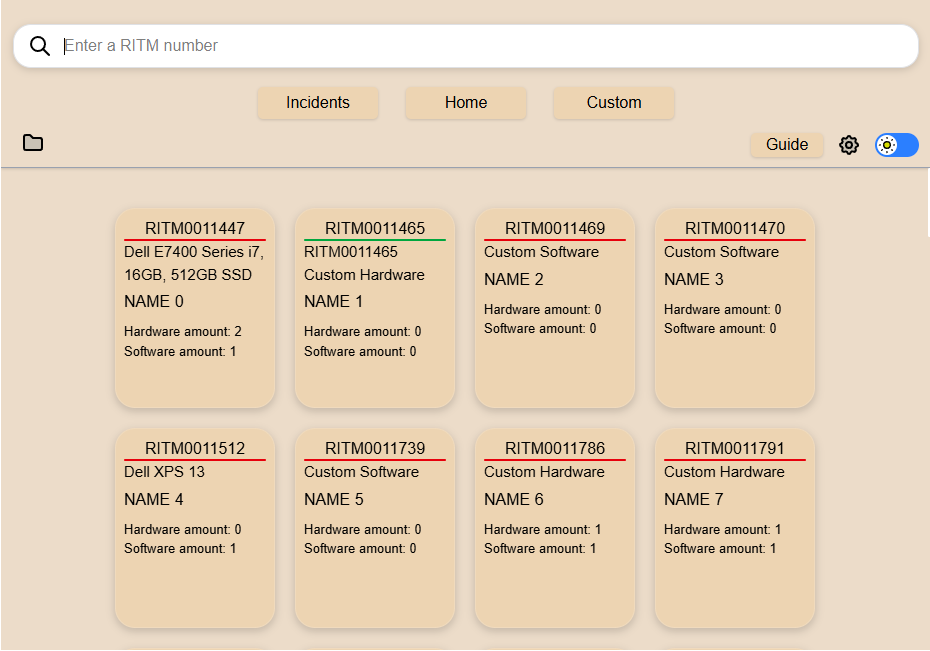
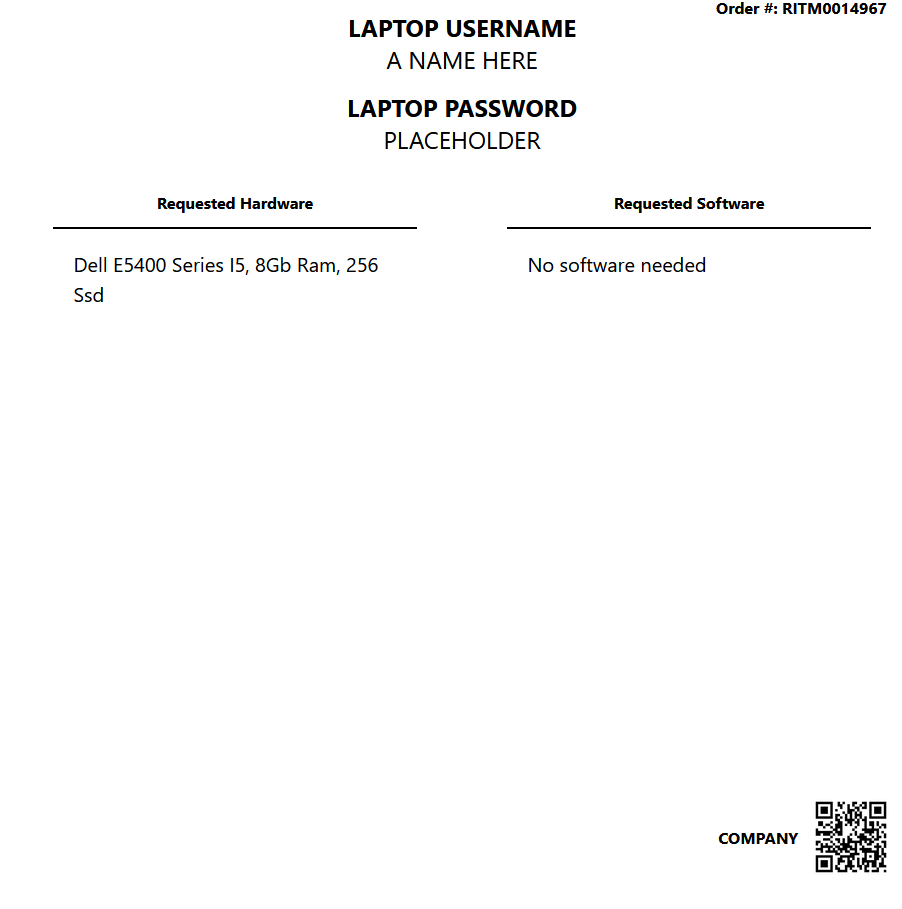

<h1 align="center">TEKLabeler - A ServiceNow IT Asset Management Tool</h1>

*TEKLabeler* is an application used to generate HTML labels to assist with device deployment and provisioning by
utilizing ServiceNow RITM tickets as the primary source of data. These labels contain the items wanted in an order
as requested by the end user.
It features:
- HTML label generation by reading Excel data.
- Customizable filters to handle various data type names dynamically.
- Customizable label word filtering for adding certain words or filters to the label.
- Customizable label features.
- Manual label creation for generation outside of Excel data as needed.

It is powered by Python and React JS.

# Table of Contents

- [Usage](#usage)
    - [Installation](#installation)
    - [Getting Started](#getting-started)
    - [Label](#label)
    - [Updating](#updating)
    - [Uninstalling](#uninstalling)
- [License](#license)

# Usage

This application is **only supported on Windows**. For more detailed documentation visit the `docs` folder.

## Installation

The latest release can be found at the [releases page](https://github.com/bobllor/TEKLabeler/releases).

The releases have two files:
1. The executable file.
2. A ZIP file containing the files for the exe. 

To install the executable file:
1. Download the file from the releases page.
2. Install the executable, at the end it will prompt you to launch the application.

The default location it is installed in is `C:\Users\<USERNAME>\AppData\Local\Programs`.

To install the ZIP file:
1. Extract the contents to a folder of your choice.
2. Run `TEKLabeler.exe`.

## Getting Started

To use the application, the Excel files must have the following columns/headers:
| Column Name | Description | 
| ----------- | ----------- |
| Full name | The full name of the user. Not required if the `First & Last Name Support` option is enabled. |
| Short description | The main item requested for the client (not additional items). |
| Customer name | The client's working company. |
| Number | The RITM number ticket of the item. |
| First name | The first name of the user. Required if the `First & Last Name Support` option is enabled. |
| Last name | The last name of the user. Required if the `First & Last Name Support` option is enabled. |

The excel file can then be uploaded or dragged into the application. Once uploaded, rows of boxes are generated from the Excel file.

Clicking on a box or searching the RITM number in the search bar will generate a label.

## Label

The labels can be customized through the settings.

Inside the settings under the `Label` tab has six options, five of which directly affect the label output.

| Option | Description |
| ------ | ----------- |
| Column Filters | Filter Excel column/headers to display on the `Hardware` and `Software` section of the label. |
| Column Mapping | Change the required Excel headers of your choice, by default it is the required column names. |
| Word Filters | Used to filter out certain words from the column/headers. For example, `Add Monitor` -> `Monitor`. |
| Upload Logo | Use a logo at the top of the label. It requires a minimum size of 932x207. |
| Default Password | The default password used to login to the device, used for the end user who receives the device. | 

## Updating

To update the application, you can either run the newest installation version via the executable or
replace the files with the contents of the ZIP file.

## Uninstalling

The application is available to uninstall through Control Panel or through Apps & Features.

To uninstall, search for `TEKLabeler` and follow the process.

Remove the files in `C:\Users\<USERNAME>\AppData\Local\Programs\TEKLabeler` afterwards to fully clean up the installation.

For the ZIP file, remove the folder where the contents were extracted to.

# License

TEKLabeler is available under the [MIT license](https://opensource.org/license/MIT).