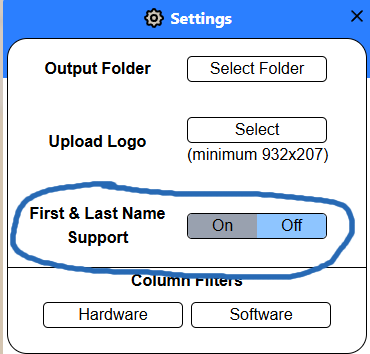

# Reports

# Required Columns

There are **four** or **five** columns that <u>must exist</u> in every report in some form:

1. ***Full name\****: The client's name.
2. ***Short description***: The main item being requested.
3. ***Customer name***: The client's company they are under.
4. ***Number***: The RITM number of the requested item (RITM1234567).

*Full name is only required if the "First & Last Name Support" option is disabled in the Settings menu.
 
If it is enabled, then the program <u>expects two columns</u> instead of a single "Full Name":
1. ***First name***
2. ***Last name***

These columns are the default expected column names, and the program will look for these columns to map them to the variable needed to generate the label properly.

**However**, if your Excel file *does not have these column names*, then the file will be rejected.
 
If your file has these types but with a different naming convention, then you must change the mapping for the variables directly. This can be accessed via <u>Settings</u> menu under the tab "Label".
- For more information, visit the *Settings* documentation tab with the section header "Column Mapping Option".

# Column Values

    

The remaining columns for the filters will be divided into two categories: *hardware* and *software*.
- This is dependent on the input of the filters- visit the *Filters* tab for more information.

IMPORTANT: The remaining columns are expected to be only <u>two value types</u>- a **Boolean (true/false)** OR a **string**.
- This is how ServiceNow generates the column information for each ticket.
- The data parsing works based off of these two values under each non-important column.
- <u>Empty data cells</u>, which are more commonly seen with string based values, are accounted for in my program, so do not worry about them.

The end result will show on the label, as seen below.

    

For more information on the label, visit the *Label* tab.

The columns in the report can be modified as needed, you can choose what is available to the report or not.
- I heavily recommend to view my report template *Labels - Production (Improved)* as a starting point, which can be found on my GitHub or through ServiceNow (my instance).

# FAQ

## Why are there four/five columns that must exist in every report?

These columns are required because the generated label requires them. If they were missing, then the program will either crash or the label will turn out poorly.

I'd rather not have either result, so the program will reject any files missing these columns.

The good news is, I added an option to allow you to map your specific column names to the ones that are expected in the program- via the Settings option.
- However, this still requires the required column names.

## Why is there support for First Name and Last Name instead of just one Full Name?

Mainly for flexibility purposes.

The old ServiceNow only had "First Name" and "Last Name" for the columns, and while the new instance also has these columns, it has an additional "Full Name" column.

The "Full Name" column is very good and guarantees that there will be little to no errors from the requestor's side.
However, in the event that either an old report from the old ServiceNow is needed, or a report doesn't have these column headers, then this option can be used.

## Does column order matter?

No.

I wrote my backend to check for each column in the file. Additionally, I have implemented a <u>lazy caching system</u> that makes it efficient and dynamically updates if any columns are removed either from the filters or manually from the report.

To fully take advantage of the caching system, I recommend keeping the columns in the same position. However, in the end it doesn't make a difference.

Also do you really want to keep editing the columns before uploading every time?

## I want to add X, Y, and Z to the columns!

Go ahead, nothing is stopping you. Be aware that you need to *update* the <u>column filters</u> if you want it to reflect on the label.

IMPORTANT: The filters are intended only to display the items on the sections "Hardware" and "Software" for the label. If you are trying to something else other than that, it will not work.

## Why are the column values a boolean or a string?

How my program works is it takes the column names, formats them, then parses the data related to each user. The end result is displayed underneath the column on the label.

My program expects it to be either a boolean or a string, so that it can properly put itself under the correct column in the label.
- This is primarily because ServiceNow reports uses these values.

For strings, this also provides very good flexibility for non-boolean data, while also still maintaining the column filtering properties.