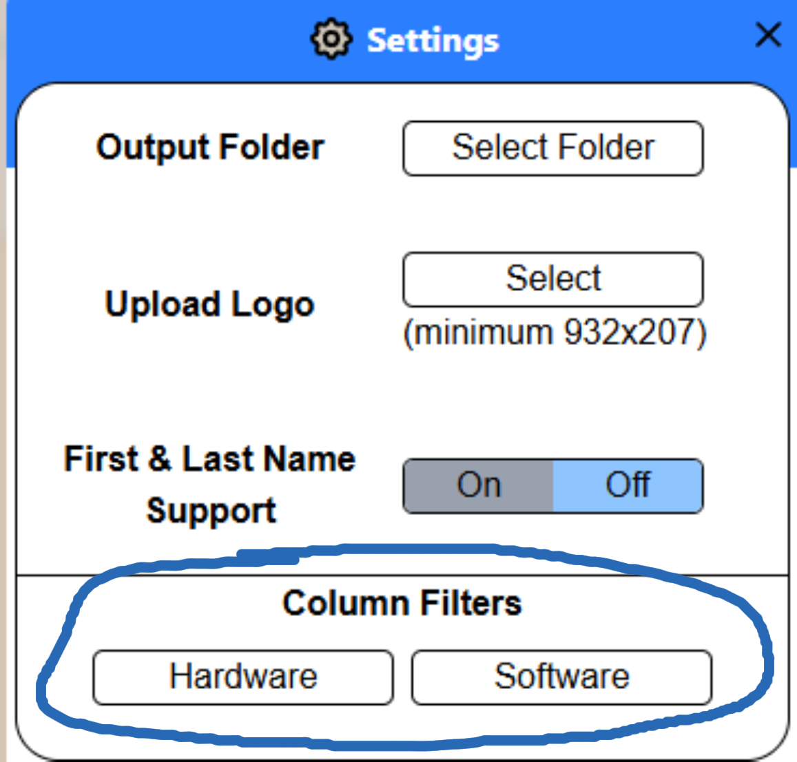
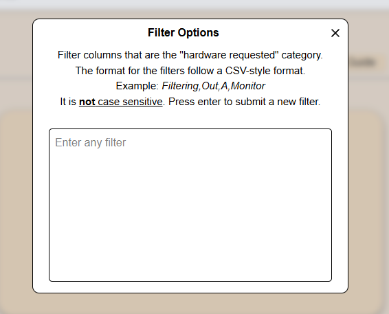
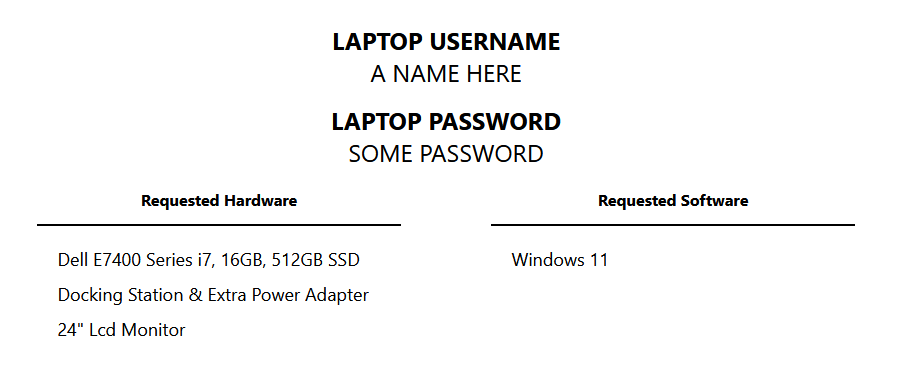
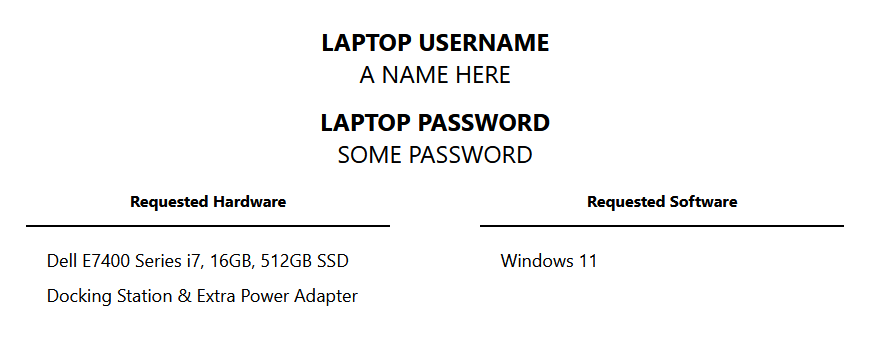
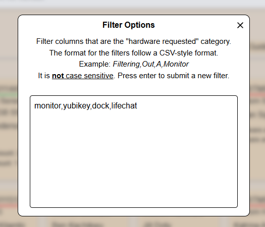

# About Filters

There are two types of filters:
1. ***Column Filters***: Filters used by the program that filters the column names into their respective group, which are "`hardware`" and "`software`".
2. ***Word Filters***: Filters used by the program which <u>removes words</u> from the column names.

Both filters uses a **CSV-style format** as its input, e.g. "`an,example,here,okay`".

# Column Filters

The column filters are used to <u>filter columns into two groups</u>, **hardware** and **software**.
- The two groups are used on the label to show what the requested items are- helping the image deployer, QA, and the end user.
- The headers of the Excel file are referred to as columns in here.

To modify filters, they can be accessed via the Settings menu by clicking on any of the two buttons at the bottom labeled "Hardware" and "Software".

    

Upon selection of either button, you will be greeted with a new pop-up box that contains a text area:

    

To submit a new filter, "Enter" is pressed to submit the new filter and update the program.
- It is mentioned below, but ensure that the input is in a **CSV-style** format.

## How to Use

In the example above, the filters are for the *hardware* group: monitor, yubikey, dock, and lifechat.
This filter reflects on the label dynamically, and these four (if applicable) will show under the correct grouping on the label.

    

The generated label above displays the monitor under the hardware column. However, if the filter for "monitor" is removed and submitted, then the label will update accordingly:

    

The role of the Column Filters is to *move the columns to their respective category*, if words need to be removed look at *Word Filters*.

# Word Filters

Word filters are used to remove words from column headers and from the final output. 
- This is <u>not the same as the column filters</u>, which filters column headers into their respective categories. 

For example, if a given input is *"Column"* and a column header is "Column Example", then the output of the value on the label would be *"Example"*.

To ensure that the filters work properly, <u>only use exact words</u> for removal. 
 
This filter **does not support partial removals**, only whole words are able to be removed.

Similar to the Column Filters above, Word Filters expects the input to be CSV-style.
- For more information, read the section "Filter Input".

# Filter Input

    

The input for Word Filters and Column Filters are expected to be <u>formatted</u> in a **CSV-style** text.

The input is automatically corrected in case multiple commas are given or an empty space is between two commas. 
- The input is **not** case-sensitive.
- The input **is spelling sensitive**.
 
Other non-comma character are considered valid words (spaces, special characters, etc...).
- I recommend typing each filter ***with no spaces*** because the program searches the filter <u>if it is found in the column name</u> rather than an exact match.

# FAQ

## Why were the filters made?

This is what makes the program dynamic and flexible, I wanted to let the user change the columns as needed.

I wrote it like this because a previous script written by someone else did not account for that. I wanted to future proof this program as much as possible.