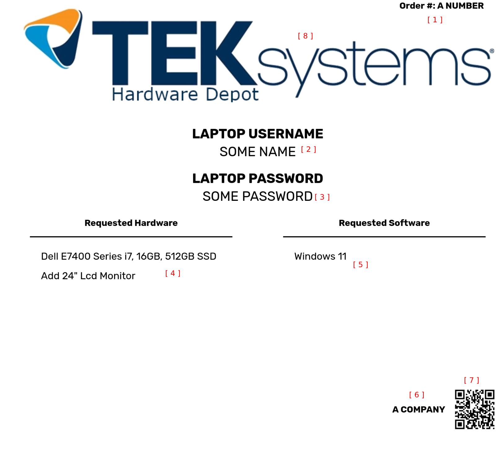

# About Labels

The output of this program is to generate an HTML document that is used to print out to use as a label.

    

1. *RITM Number*: The number of the ticket.
2. *Username*: The login for the user.
3. *Password*: The password for the user. This should be a default password, **DO NOT** use sensitive passwords here.
4. *Hardware Requested*: The physical hardware the user requested, depedent on the filters.
5. *Software Requested*: The software the user requested, dependent on the filters.
6. *Company*: The company the user is contracted to.
7. *QR Code*: Only used for scanning purposes, if scanned the output is "First.Last\rFirst Last". This is primarily used for scanning into a CMD script to generate the user account.
8. *Logo*: The logo used to display on the logo. This is not required, and is more for "design" purposes.

# Label Modifications

Modifications to the final output can be done through the Settings menu with deeper explanations on how the settings modify the final output.

The modifiable parts of the label are (with their respective setting option):
- *RITM Number*: Column Mapping
- *Username*: Column Mapping (first, last, full names)
- *Password*: Labels Tab (at the bottom)
- *Hardware & Software Requested*: Column Filters
- *Company*: Column Mapping
- *Logo*: General Tab

# FAQ

## I want to change the logo, how?

Settings, it's located in the General tab.

If you want to remove the logo, then press the arrow button next to the upload button and confirm the modal popup.